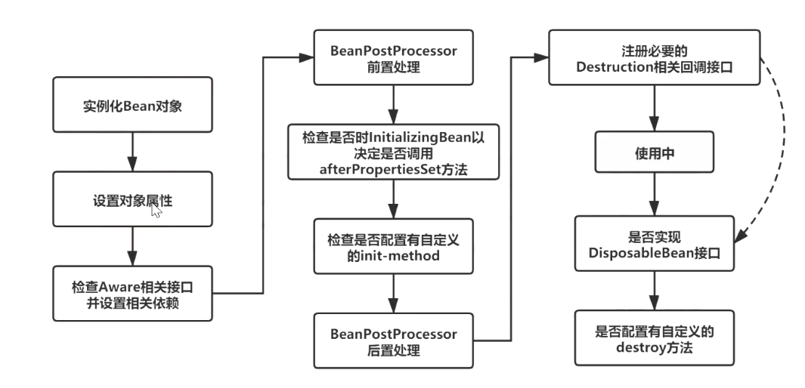
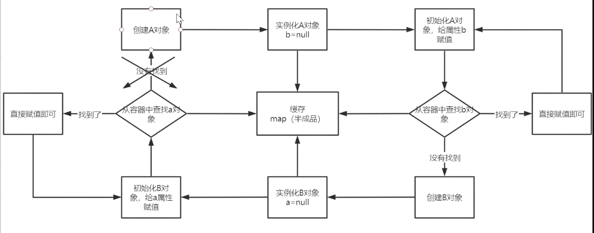
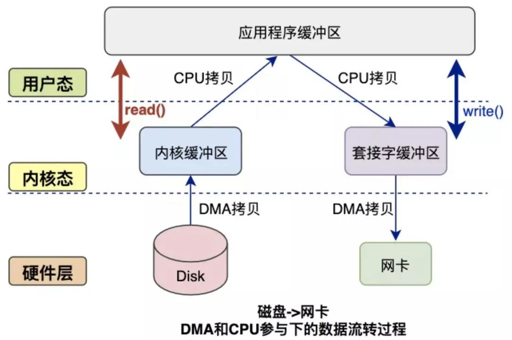

# 知识点

## IOC

1. 在refreshBeanFactory()
   方法中创建IOC容器：通过createBeanFactory创建一个DefaultListableBeanFactory，然后set序列化ID，然后通过customizeBeanFactory对容器进行定制化，然后调用载入bean定义的方法，这里通过loadBeanDifinition方法实现，该方法是一个抽象方法，具体的实现调用子类容器
2. 开始循环创建对象，因为容器中的对象都是单例，所以优先通过getBean，doGetBean在容器中查找
3. 找不到的话才通过createBean（doCreateBean才是真正的创建方法）以反射的方式创建对象，一般都是使用的无参构造（getDeclaredConstructor，newInstance方法等）
4. 填充对象的属性（populateBean等方法）
5. 其他的初始化操作(initializingBean方法)

## 容器

用于存储对象，使用的是map结构，spring一般存在三级缓存，singletonObject存放完整的bean对象

### 整个过程

1. beanFactory.DefaultListableBeanFactory创建，想bean工厂设置一些参数（BeanPostProcessor。Aware接口的子类）
2. 加载解析bean对象，准备好要创建的bean对象的定义对象beanDifinition
3. beanFactoryPostProcessor的处理
4. beanPostProcessor的注册功能，方便后续对bean对象完成具体的扩展
5. 通过反射将beanDefinition对象实例化成具体的bean对象
6. bean的初始化过程
7. 生成完整的bean对象，通过getBean获取
8. 销毁

## Bean的生命周期



1. 通过反射
2. populateBeanBean方法，循环依赖问题在此处解决，带出来三级缓存
3. 调用aware接口相关方法：invokeAwareMethod（完成Bean的name、factory、classloader的属性设置）
4. 用的多的前置处理方法：ApplicationContextPostProcessor
5. 调用initmethod方法判断是否实现了initializingBean接口，如果有。。。
6. 调用。。。的后置处理方法，aop在此处实现：AbstractAutoProxyCreator
7. 注册Destruction相关接口
8. 获取完整对象
9. 销毁

## 循环依赖问题



创建A对象：先实例化A，然后初始化的时候给属性ｂ赋值，此时容器中没有ｂ，所以开始创建B对象：先实例化B对象，然后初始化的时候给属性ａ赋值，此时容器中没有ａ，所以开始创建A对象：。。。

以上是造成循环依赖的原因

此时A对象是存在的，但是A不是一个完整的状态（完成实例化，未完成初始化）。

所以我们完全可以将这个不完整的对象的引用暴露出来，等后期再给他赋值。（核心操作：初始化和实例化分开操作）暴露的方法就是将这个不完整的对象放到map中（三级缓存在同一容器，所以用三个map）。

1. 一级缓存：singletonObjects。完整对象，完成初始化

2. 二级缓存：earlySingletonObjects。完成品，完成实例化，未完成初始化

3. 三级缓存：singletonFactories。完成实例化，value是ObjectFactory<?>
   ，是一个函数式接口。实际上，所有对象都完成实例化和初始化操作后，就只有1、2两种状态存在。存在意义：保证在整个容器的运行过程中，保证bean名称的唯一性。

   为什么要保证唯一性？

   如果一个bean对象被代理，需要优先被生成他的普通对象，但是代理对象普通对象不能共存（代理会通过getEarlyBeanReference()
   覆盖普通），所以所有的对象都需要先放到三级缓存中，在后续的使用过程中，如果需要被代理则返回代理对象，不需要就直接返回普通对象

查询顺序是1、2、3，所以只要一级缓存中有，那二三级一定没有

```java
/**
 * 创建bean的过程
 */
package org.springframework.beans.factory.support.AbstractAutowireCapableBeanFactory;

protected Object doCreateBean(final String beanName,final RootBeanDefinition mbd,final @Nullable Object[]args)
        throws BeanCreationException{

        // Instantiate the bean.
        //封装被创建的Bean对象
        BeanWrapper instanceWrapper=null;
        if(mbd.isSingleton()){
        instanceWrapper=this.factoryBeanInstanceCache.remove(beanName);
        }
        if(instanceWrapper==null){
        instanceWrapper=createBeanInstance(beanName,mbd,args);
        }
final Object bean=instanceWrapper.getWrappedInstance();
        //获取实例化对象的类型
        Class<?> beanType=instanceWrapper.getWrappedClass();
        if(beanType!=NullBean.class){
        mbd.resolvedTargetType=beanType;
        }

// Allow post-processors to modify the merged bean definition.
//调用PostProcessor后置处理器
synchronized (mbd.postProcessingLock){
        if(!mbd.postProcessed){
        try{
        applyMergedBeanDefinitionPostProcessors(mbd,beanType,beanName);
        }
        catch(Throwable ex){
        throw new BeanCreationException(mbd.getResourceDescription(),beanName,
        "Post-processing of merged bean definition failed",ex);
        }
        mbd.postProcessed=true;
        }
        }

        // Eagerly cache singletons to be able to resolve circular references
        // even when triggered by lifecycle interfaces like BeanFactoryAware.
        //向容器中缓存单例模式的Bean对象，以防循环引用
        boolean earlySingletonExposure=(mbd.isSingleton()&&this.allowCircularReferences&&
        isSingletonCurrentlyInCreation(beanName));
        if(earlySingletonExposure){
        if(logger.isDebugEnabled()){
        logger.debug("Eagerly caching bean '"+beanName+
        "' to allow for resolving potential circular references");
        }
        //这里是一个匿名内部类，为了防止循环引用，尽早持有对象的引用
        addSingletonFactory(beanName,()->getEarlyBeanReference(beanName,mbd,bean));
        }

        // Initialize the bean instance.
        //Bean对象的初始化，依赖注入在此触发
        //这个exposedObject在初始化完成之后返回作为依赖注入完成后的Bean
        Object exposedObject=bean;
        try{
        //将Bean实例对象封装，并且Bean定义中配置的属性值赋值给实例对象
        populateBean(beanName,mbd,instanceWrapper);
        //初始化Bean对象
        exposedObject=initializeBean(beanName,exposedObject,mbd);
        }
        catch(Throwable ex){
        if(ex instanceof BeanCreationException&&beanName.equals(((BeanCreationException)ex).getBeanName())){
        throw(BeanCreationException)ex;
        }
        else{
        throw new BeanCreationException(
        mbd.getResourceDescription(),beanName,"Initialization of bean failed",ex);
        }
        }

        if(earlySingletonExposure){
        //获取指定名称的已注册的单例模式Bean对象
        Object earlySingletonReference=getSingleton(beanName,false);
        if(earlySingletonReference!=null){
        //根据名称获取的已注册的Bean和正在实例化的Bean是同一个
        if(exposedObject==bean){
        //当前实例化的Bean初始化完成
        exposedObject=earlySingletonReference;
        }
        //当前Bean依赖其他Bean，并且当发生循环引用时不允许新创建实例对象
        else if(!this.allowRawInjectionDespiteWrapping&&hasDependentBean(beanName)){
        String[]dependentBeans=getDependentBeans(beanName);
        Set<String> actualDependentBeans=new LinkedHashSet<>(dependentBeans.length);
        //获取当前Bean所依赖的其他Bean
        for(String dependentBean:dependentBeans){
        //对依赖Bean进行类型检查
        if(!removeSingletonIfCreatedForTypeCheckOnly(dependentBean)){
        actualDependentBeans.add(dependentBean);
        }
        }
        if(!actualDependentBeans.isEmpty()){
        throw new BeanCurrentlyInCreationException(beanName,
        "Bean with name '"+beanName+"' has been injected into other beans ["+
        StringUtils.collectionToCommaDelimitedString(actualDependentBeans)+
        "] in its raw version as part of a circular reference, but has eventually been "+
        "wrapped. This means that said other beans do not use the final version of the "+
        "bean. This is often the result of over-eager type matching - consider using "+
        "'getBeanNamesOfType' with the 'allowEagerInit' flag turned off, for example.");
        }
        }
        }
        }

        // Register bean as disposable.
        //注册完成依赖注入的Bean
        try{
        registerDisposableBeanIfNecessary(beanName,bean,mbd);
        }
        catch(BeanDefinitionValidationException ex){
        throw new BeanCreationException(
        mbd.getResourceDescription(),beanName,"Invalid destruction signature",ex);
        }

        return exposedObject;
        }
```

## Bean Factory和FactoryBean的区别

前者创建需要严格遵守生命周期，太麻烦，有时候需要简单的自定义一个对象，而且还想交给spring管理，这时候就需要用到后者了

三个方法：

1. isSingleton：是否为单例
2. getObjectType：获取返回对象类型
3. getObject：自定义创建对象过程（可以自己new，也可以反射，也可以动态代理）

## Java8-11特性

1. 接口可以定义私有方法
2. var--局部变量推断：不是关键字，而是保留字。编译器可推断的类型都可以用var
3. 集合：多了创建不可变集合的方法（.of()）等
4. ProcessHandle 接口，可以管理原生进程
5. IO流多了方法来复制读取inputStream中的数据
6. 新增4个SHA-3哈希算法
7. 对HTTP Client API升级
8. 简化启动单个源代码文件：之前先编译成class再解释执行，现在可以直接执行java文件
9. 统一JVM日志，G1升级为并行（之前单线程，现在多线程），统一GC接口

## Thread.sleep(0)触发GC

```java
public void preventGC(){
        for(int i=0;i< 100000;i++){
        //do something

        //prevent(阻止) GC
        if(i%1000==0){
        try{
        Thread.sleep(0);
        }catch(InterruptedException e){
        throw new RuntimeException(e);
        }
        }
        }
        }
```

Thread.sleep(0)
这句代码并不是字面意思上的“阻止GC”，而是“触发GC”：好处就是可以让GC被操作系统选中（为啥？因为sleep会释放资源。为啥不用yield？因为yield让出资源，只给同等级的让），从而进行GC，这样就可以一直GC，可以避免长时间GC（STW问题）

所以这个应该是阻止长时间GC。

### 问题来了：**为啥这么就能触发GC？**

安全点：safepoint，程序执行的一些特定位置，只有到了这些特定位置，程序才能GC

hotSpot虚拟机，对for循环的优化：对于int，或更小范围的数据类型作为索引的循环——可数循环，默认不放置安全点，而long或更大的数据类型作为索引的循环——不可数循环，将会被放置安全点

### 问题又来了：**怎么进入安全点**？

[源码注释](https://hg.openjdk.java.net/jdk8u/jdk8u/hotspot/file/tip/src/share/vm/runtime/safepoint.cpp)

```java
  // Begin the process of bringing the system to a safepoint.
// Java threads can be in several different states and are
// stopped by different mechanisms:
//
//  1. Running interpreted
//     The interpeter dispatch table is changed to force it to
//     check for a safepoint condition between bytecodes.
//  2. Running in native code
//     When returning from the native code, a Java thread must check
//     the safepoint _state to see if we must block.  If the
//     VM thread sees a Java thread in native, it does
//     not wait for this thread to block.  The order of the memory
//     writes and reads of both the safepoint state and the Java
//     threads state is critical.  In order to guarantee that the
//     memory writes are serialized with respect to each other,
//     the VM thread issues a memory barrier instruction
//     (on MP systems).  In order to avoid the overhead of issuing
//     a memory barrier for each Java thread making native calls, each Java
//     thread performs a write to a single memory page after changing
//     the thread state.  The VM thread performs a sequence of
//     mprotect OS calls which forces all previous writes from all
//     Java threads to be serialized.  This is done in the
//     os::serialize_thread_states() call.  This has proven to be
//     much more efficient than executing a membar instruction
//     on every call to native code.
//  3. Running compiled Code
//     Compiled code reads a global (Safepoint Polling) page that
//     is set to fault if we are trying to get to a safepoint.
//  4. Blocked
//     A thread which is blocked will not be allowed to return from the
//     block condition until the safepoint operation is complete.
//  5. In VM or Transitioning between states
//     If a Java thread is currently running in the VM or transitioning
//     between states, the safepointing code will wait for the thread to
//     block itself when it attempts transitions to a new state.
```

重点看2，意思是执行native方法后，返回Java线程的时候必须检测一遍safepoint

详细点：某个线程执行native函数时，该线程在执行JVM管理之外的代码，不能对JVM执行状态做修改，而JVM外部要对其执行状态做修改时，必须通过JNI函数，而JNI函数的入口处都有safepoint检查（sleep()
就是一个native方法--JNI调用），只要检测到safepoint，就会把控制权交给JVM

## Excel 批注图片导出

引入 free spire.xls.jar

```java
import com.spire.xls.*;

import javax.imageio.ImageIO;
import java.awt.*;
import java.awt.image.BufferedImage;
import java.io.File;
import java.io.IOException;

public class ExtractComment {
    
    public static void main(String[] args) throws IOException {
        //加载excel文档        
        Workbook wb = new Workbook();
        wb.loadFromFile("sample.xlsx");
        //获取工作表
        Worksheet sheet = wb.getWorksheets().get(0);
        //获取指定单元格中的批注背景图片        
        BufferedImage image = (BufferedImage) sheet.getRange()
                                                    .get("H2") //H列2行
                                                    .getComment()
                                                    .getFill()
                                                    .getPicture();
        ImageIO.write(image, "png", new File("ExtractedImages.png"));
    }
}
```
## 注解

### 框架注解

@Controller。。。

### 原生注解

@override、@Deprecated、@FunctionInterface等

### 元注解

#### @Target

可以修饰那些地方：class、method、param

#### @Retention

什么时候执行：source编译前、class编译时、run运行时

### 自定义注解场景

#### 监控预警

运行时间、异常捕捉啥的

## NIO

NIO，可以实现无阻塞IO（以数据块-缓存区的形式处理），传统IO只能实现阻塞IO（字节）

分三部分：

1. buffer：缓冲区
2. channel：管道
3. select：选择器

### NIO demo

```java
public class NoBlockServer {

    public static void main(String[] args) throws IOException {
        // 1.获取通道
        ServerSocketChannel server = ServerSocketChannel.open();
        // 2.切换成非阻塞模式
        server.configureBlocking(false);
        // 3. 绑定连接
        server.bind(new InetSocketAddress(6666));
        // 4. 获取选择器
        Selector selector = Selector.open();
        // 4.1将通道注册到选择器上，指定接收“监听通道”事件
        server.register(selector, SelectionKey.OP_ACCEPT);
        // 5. 轮训地获取选择器上已“就绪”的事件--->只要select()>0，说明已就绪
        while (selector.select() > 0) {
            // 6. 获取当前选择器所有注册的“选择键”(已就绪的监听事件)
            Iterator<SelectionKey> iterator = selector.selectedKeys().iterator();
            // 7. 获取已“就绪”的事件，(不同的事件做不同的事)
            while (iterator.hasNext()) {
                SelectionKey selectionKey = iterator.next();
                // 接收事件就绪
                if (selectionKey.isAcceptable()) {
                    // 8. 获取客户端的链接
                    SocketChannel client = server.accept();
                    // 8.1 切换成非阻塞状态
                    client.configureBlocking(false);
                    // 8.2 注册到选择器上-->拿到客户端的连接为了读取通道的数据(监听读就绪事件)
                    client.register(selector, SelectionKey.OP_READ);
                } else if (selectionKey.isReadable()) { // 读事件就绪
                    // 9. 获取当前选择器读就绪状态的通道
                    SocketChannel client = (SocketChannel) selectionKey.channel();
                    // 9.1读取数据
                    ByteBuffer buffer = ByteBuffer.allocate(1024);
                    // 9.2得到文件通道，将客户端传递过来的图片写到本地项目下(写模式、没有则创建)
                    FileChannel outChannel = FileChannel.open(Paths.get("2.png"), StandardOpenOption.WRITE, StandardOpenOption.CREATE);
                    while (client.read(buffer) > 0) {
                        // 在读之前都要切换成读模式
                        buffer.flip();
                        outChannel.write(buffer);
                        // 读完切换成写模式，能让管道继续读取文件的数据
                        buffer.clear();
                    }
                }
                // 10. 取消选择键(已经处理过的事件，就应该取消掉了)
                iterator.remove();
            }
        }
    }
}
```

```java
public class NoBlockClient {

    public static void main(String[] args) throws IOException {
        // 1. 获取通道
        SocketChannel socketChannel = SocketChannel.open(new InetSocketAddress("127.0.0.1", 6666));
        // 1.1切换成非阻塞模式
        socketChannel.configureBlocking(false);
        // 1.2获取选择器
        Selector selector = Selector.open();
        // 1.3将通道注册到选择器中，获取服务端返回的数据
        socketChannel.register(selector, SelectionKey.OP_READ);
        // 2. 发送一张图片给服务端吧
        FileChannel fileChannel = FileChannel.open(Paths.get("X:\Users\ozc\Desktop\面试造火箭\1.png"), StandardOpenOption.READ);
        // 3.要使用NIO，有了Channel，就必然要有Buffer，Buffer是与数据打交道的呢
        ByteBuffer buffer = ByteBuffer.allocate(1024);
        // 4.读取本地文件(图片)，发送到服务器
        while (fileChannel.read(buffer) != -1) {
            // 在读之前都要切换成读模式
            buffer.flip();
            socketChannel.write(buffer);
            // 读完切换成写模式，能让管道继续读取文件的数据
            buffer.clear();
        }
        // 5. 轮训地获取选择器上已“就绪”的事件--->只要select()>0，说明已就绪
        while (selector.select() > 0) {
            // 6. 获取当前选择器所有注册的“选择键”(已就绪的监听事件)
            Iterator<SelectionKey> iterator = selector.selectedKeys().iterator();
            // 7. 获取已“就绪”的事件，(不同的事件做不同的事)
            while (iterator.hasNext()) {
                SelectionKey selectionKey = iterator.next();
                // 8. 读事件就绪
                if (selectionKey.isReadable()) {
                    // 8.1得到对应的通道
                    SocketChannel channel = (SocketChannel) selectionKey.channel();
                    ByteBuffer responseBuffer = ByteBuffer.allocate(1024);
                    // 9. 知道服务端要返回响应的数据给客户端，客户端在这里接收
                    int readBytes = channel.read(responseBuffer);
                    if (readBytes > 0) {
                        // 切换读模式
                        responseBuffer.flip();
                        System.out.println(new String(responseBuffer.array(), 0, readBytes));
                    }
                }
                // 10. 取消选择键(已经处理过的事件，就应该取消掉了)
                iterator.remove();
            }
        }
    }
}
```

### IO模型

阻塞IO、非阻塞IO、复用IO、信号驱动、异步IO

#### 复用IO

一个线程监控多个文件描述符，某个文件准备就绪，就去通知程序做相应处理

并不能提高速度，只是能处理更多的连接

##### select()

需要传入fd_set参数，一个bitmap结构（0，1）表示为发生变化就为1 ，遍历df_set，通知程序处理

df_set有大小限制（1024或2048根据操作系统位数定）

##### epoll()

给所有就绪文件维护了一个空间，每次从就绪列表拿就行|

### 零拷贝

前提：为了保证操作系统的安全，把虚拟空间划分为：用户空间、内核空间

每次读取数据的时候会从这两个状态进行切换（内核态<>用户态）

读操作为例：CPU通过**DMA**将**磁盘数据**拷贝到**内核空间**，然后再拷贝到**用户空间**

零拷贝就是跳过中间步骤

