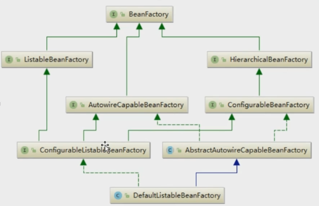

# Spring源码

## 设计模式

六大原则

1. 开闭原则：对扩展开放，对修改关闭。（接口和抽象类，遵循该原则）
2. 里氏代换原则：对开闭原则的补充，基类（父类）可以出现的地方，子类也可以出现（父子类继承）
3. 依赖倒转原则：开闭原则的基础
4. 接口隔离原则：针对接口编程，依赖于抽象而不依赖于具体
5. 迪米特法则：一个实体应当尽量少的与其他实体之间发生相互作用，模块相互独立
6. 合成复用原则：尽量使用聚合的方式，而不是使用继承

### spring中的工厂模式运用：



### 单例模式：

1. 饿汉式：调用前就实例化，保证线程同步
2. 懒汉式：用的时候才加载，可以用反射二次创建
3. 注册式：使用过的而对象，放到固定容器，下次使用时，从容器中拿（IOC中的单例就是注册登记式单例）掌握这个就行
4. 序列化与反序列化：重写readResolve()

### 原型模式：

​	使用对象前，会把所有该对象的完整的依赖关系重新赋给新创建的对象（使用clone实现，apache反射实现）

### 代理模式：

​	底层实现就是做字节码重组

```java
/**
* 字节码重组
* 1、拿到代理对象的引用，并获取到他的所有接口，反射获取
* 2、JDKProxy重新生成新的类、同时新的类要实现代理类所实现的所有接口
* 3、动态生成Java代码，在把自己新加的业务逻辑方法由一定的而逻辑代码调用（代码体现）
* 4、编译成.class
* 5、重新加载到JVM运行
*/


```

```java

/**
* $Proxy0.class文件
*/
public final class $Proxy0 extends Proxy implements Person {
    //m对应的是这个接口所对应的所有方法
    private static Method m1;
    private static Method m3;
    private static Method m2;
    private static Method m0;

    public $Proxy0(InvocationHandler var1) throws Exception {
        super(var1);
    }

    public final boolean equals(Object var1) throws Exception {
        try {
            return (Boolean)super.h.invoke(this, m1, new Object[]{var1});
        } catch (RuntimeException | Error var3) {
            throw var3;
        } catch (Throwable var4) {
            throw new UndeclaredThrowableException(var4);
        }
    }

    public final void eat() throws Exception {
        try {
            //JDKProxy.InvocationHandler.invoke(Object proxy, Method method, Object[] args)
            super.h.invoke(this, m3, (Object[])null);
        } catch (RuntimeException | Error var2) {
            throw var2;
        } catch (Throwable var3) {
            throw new UndeclaredThrowableException(var3);
        }
    }

    public final String toString() throws Exception {
        try {
            return (String)super.h.invoke(this, m2, (Object[])null);
        } catch (RuntimeException | Error var2) {
            throw var2;
        } catch (Throwable var3) {
            throw new UndeclaredThrowableException(var3);
        }
    }

    public final int hashCode() throws Exception {
        try {
            return (Integer)super.h.invoke(this, m0, (Object[])null);
        } catch (RuntimeException | Error var2) {
            throw var2;
        } catch (Throwable var3) {
            throw new UndeclaredThrowableException(var3);
        }
    }

    static {
        try {
            m1 = Class.forName("java.lang.Object").getMethod("equals", Class.forName("java.lang.Object"));
            m3 = Class.forName("jdk.Person").getMethod("eat");
            m2 = Class.forName("java.lang.Object").getMethod("toString");
            m0 = Class.forName("java.lang.Object").getMethod("hashCode");
        } catch (NoSuchMethodException var2) {
            throw new NoSuchMethodError(var2.getMessage());
        } catch (ClassNotFoundException var3) {
            throw new NoClassDefFoundError(var3.getMessage());
        }
    }
}
```

例如：jdbc：我（目标对象），数据库（目的），jdbc（代理对象），我通过jdbc获取到数据库的信息

静态代理：代理之前，所有东西都是已知的

动态代理：在代理之前，所有东西都是未知的

JDK动态代理

```java
public class JDKProxy implements InvocationHandler {
    @Override
    public Object invoke(Object proxy, Method method, Object[] args) throws Throwable {
        System.out.println("代理类：满足需求");
        //调用对象
        method.invoke(this.target, args);
        System.out.println("完成");
        return null;
    }

    private Person target;

    public Object getInstance(Person target) throws Exception {
        this.target = target;
        Class<?> clazz = target.getClass();
        return Proxy.newProxyInstance(clazz.getClassLoader(), clazz.getInterfaces(), this);
    }
}
```

Cglib动态代理

```java
public class CglibProxy implements MethodInterceptor {
    @Override
    public Object intercept(Object o, Method method, Object[] objects, MethodProxy methodProxy) throws Throwable {
        //业务增强
        methodProxy.invokeSuper(o, objects);
        return null;
    }

    public Object getInstance(Class<?> clazz) throws Exception {
        Enhancer enhancer = new Enhancer();
        //clazz是即将生成的类的父类
        enhancer.setSuperclass(clazz);
        //由自己调用
        enhancer.setCallback(this);
        return enhancer.create();
    }
}
```

